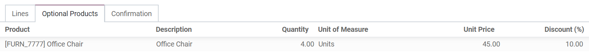
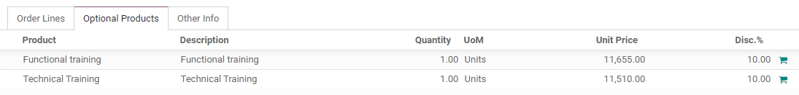
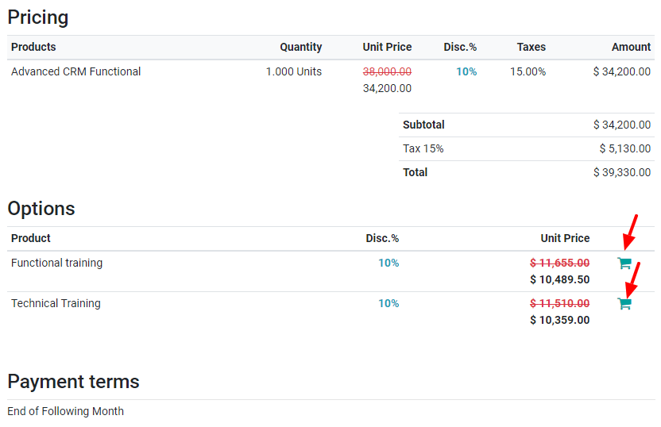
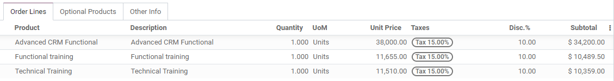

=====================
Add optional products
=====================

The use of optional products is a marketing strategy for cross-selling products along with a core
product. The aim is to offer useful and related products to your customers. For instance, if a
customer wants to buy a car, he has the choice to order an automatic opening trunk and massaging
seats, or not to order such high quality products and simply buy his car.

Add optional products to your quotation templates
=================================================

Be sure to check out our documentation about :doc:`quote_template` to understand how you can
enable, create, design and manage your own quotation templates before reading this part.

For each template, you have an **Optional Products** tab where you can add related products or
services.

Add optional products to your quotations
========================================

For your information, it is possible to add or modify optional products directly on quotations
(under the **Optional Products** tab, as you can see below).

.. note::
   Now, by clicking on the **Customer Preview** button, you will be able to see what your customers
   will have as possibilities after opening a quotation from their received email. In fact, they
   will have the practicability to add different optional products to their order by using
   associated carts and the layout will be even more user-friendly.

   .. image:: media/optional_products_3.png
      :align: center
      :class: img-thumbnail
      :alt: Preview your quotations on Odoo Sales

Depending on the confirmation process you will choose, under :menuselection:`Sales → Configuration
→ Settings`, your customers will be able to sign digitally or pay directly to confirm the quotation.
This feature is explained here: :doc:`quote_template`.

For example, if a customer selects all the optional products suggested, these additional items will
automatically fill in the quotation managed by the salesman.

Like this, salespeople will see each movement made by the customer and tracking the order will be
all the better.

With Odoo Sales, it is now very convenient to understand your customer's needs.

.. seealso::
   - :doc:`quote_template`